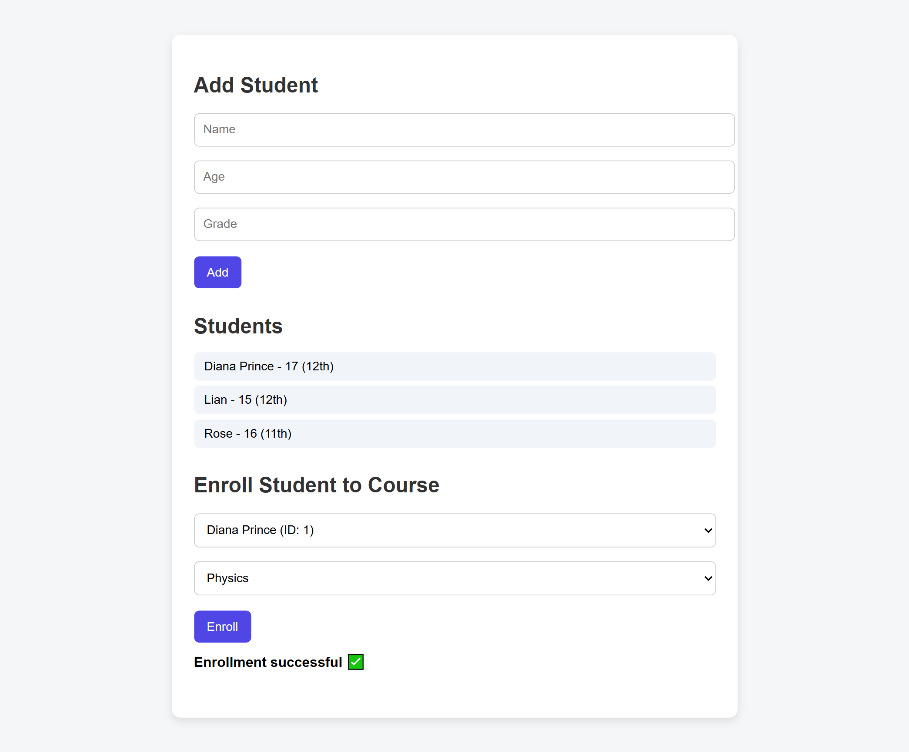
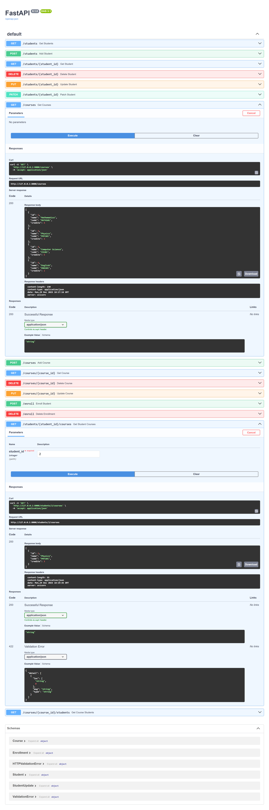

# Student Management System

A full-stack **Student Management System** built with **FastAPI**, **MySQL**, and a simple **HTML/JavaScript frontend**.  
This project demonstrates CRUD operations, relational database design, and frontend-backend integration for educational management.


## Features

- Student CRUD operations
- Course management
- Student–Course enrollment (many-to-many)
- RESTful API design
- Interactive API docs via **Swagger UI**
- Simple frontend using **HTML, CSS, JavaScript**


## Technologies Used

- **Backend:** Python 3.12, FastAPI, Pydantic  
- **Database:** MySQL (students, courses, enrollments)  
- **Frontend:** HTML, JavaScript, CSS  
- **Tools:** Uvicorn (ASGI server), Swagger for API testing  
- **Version Control:** Git + GitHub  

---

## Setup Instructions

### 1. Clone the repository
```bash
git clone https://github.com/Nasee-t/student-management-1.git
cd student-management-1
```

### 2. Install dependencies
```bash
pip install fastapi uvicorn mysql-connector-python python-dotenv
```

### 3. Setup MySQL Database

```bash
CREATE DATABASE student_db;
USE student_db;

CREATE TABLE students (
    id INT AUTO_INCREMENT PRIMARY KEY,
    name VARCHAR(100) NOT NULL,
    age INT NOT NULL,
    grade VARCHAR(10) NOT NULL
);

CREATE TABLE courses (
    id INT AUTO_INCREMENT PRIMARY KEY,
    name VARCHAR(100) NOT NULL,
    code VARCHAR(20) UNIQUE NOT NULL,
    credits INT NOT NULL
);

CREATE TABLE enrollments (
    id INT AUTO_INCREMENT PRIMARY KEY,
    student_id INT NOT NULL,
    course_id INT NOT NULL,
    FOREIGN KEY (student_id) REFERENCES students(id) ON DELETE CASCADE,
    FOREIGN KEY (course_id) REFERENCES courses(id) ON DELETE CASCADE
);
```

### 4. Run the backend
```bash
python -m uvicorn main:app --reload
```
- Backend runs at http://127.0.0.1:8000
- Swagger UI for testing APIs: http://127.0.0.1:8000/docs

---

### How It Works

- API Endpoints:
  - `/students` → GET/POST/PUT/PATCH/DELETE
  - `/courses` → GET/POST/PUT/DELETE
  - `/enrollments` → POST/DELETE
- Frontend: Fetches data via fetch API, updates UI dynamically.
- Database: MySQL stores students, courses, and enrollments with proper relationships.

---

### Environment Variables

To avoid storing credentials in code, create a .env file:

```bash
DB_HOST=localhost
DB_USER=root
DB_PASSWORD=<your-password>
DB_NAME=student_db
```
---

### Screenshots

### Student Management UI


### API Documentation (Swagger)


---

### Future Improvements

- Authentication & roles
- Real-time notifications for enrollments
- Deployment to cloud (Render, Railway, or Heroku)


